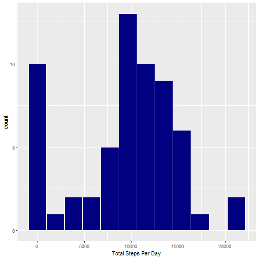
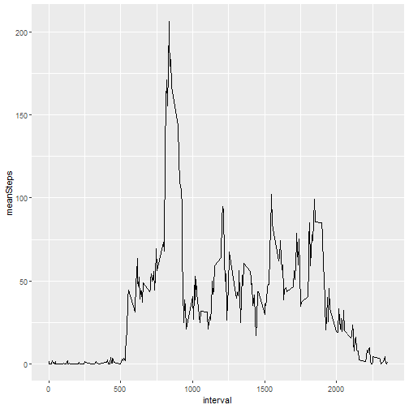
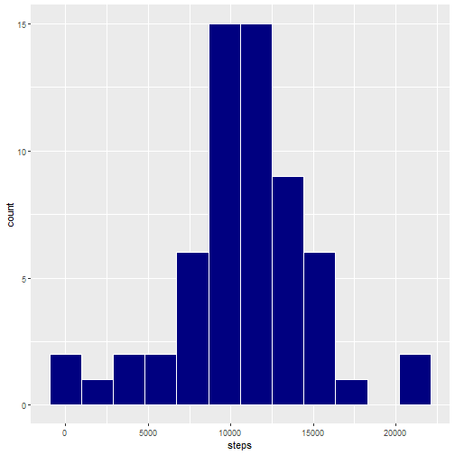
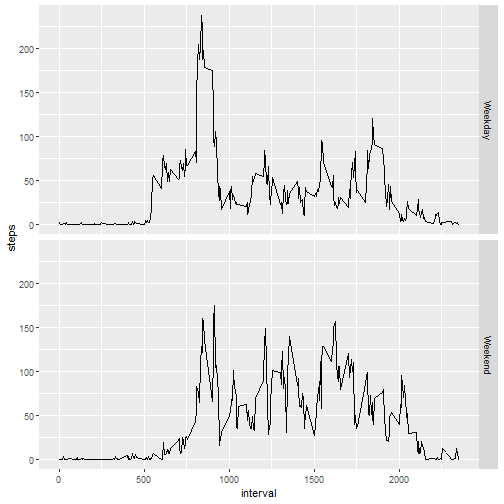

# Reproducible Research Project 1

Kevin Mahon

## Project Summary

This assignment makes use of data from a personal activity monitoring device. This device collects data at 5 minute intervals through out the day. The data consists of two months of data from an anonymous individual collected during the months of October and November, 2012 and include the number of steps taken in 5 minute intervals each day.

The goal is the view and compare data of steps taken throughout a 2 month period to see patterns based on days and times.

## Data

The data was obtained from a [GitHub repository](https://github.com/rdpeng/RepData_PeerAssessment1) which I forked into my own repository and is saved within this project's working directory by default. The variables in the data set are:  
- steps: Number of steps taken in a 5-minute interval (NA values are NA)  
- date: the date on which the measurement was taken YYYY-MM-DD  
- interval: Identifier for the 5-minute interval in which measurement was taken  

## Pulling into RStudio

The following libraries are required


```r
library(data.table)
library(dplyr)
library(lubridate)
library(ggplot2)
```

Check the directory to see what the data is called and how it is saved, unzip and save to R.


```r
dir(".")
```

```
## [1] "activity.csv"                  "activity.zip"                 
## [3] "doc"                           "figure"                       
## [5] "instructions_fig"              "PA1_template.html"            
## [7] "PA1_template.Rmd"              "README.md"                    
## [9] "RepData_PeerAssessment1.Rproj"
```

```r
unzip("activity.zip")
act <- read.csv("activity.csv")
head(act)
```

```
##   steps       date interval
## 1    NA 2012-10-01        0
## 2    NA 2012-10-01        5
## 3    NA 2012-10-01       10
## 4    NA 2012-10-01       15
## 5    NA 2012-10-01       20
## 6    NA 2012-10-01       25
```

Reclassify the date column and add 2 more based on the date/day - Any days that start with S will be Saturday or Sunday and are classified as weekend days.


```r
act$date <- ymd(act$date)
act <- data.table(act)
act[,Day:=weekdays(date)]
act[grepl("^S",act$Day),Weekday_end:="Weekend"]
act[!grepl("^S",act$Day),Weekday_end:="Weekday"]
```

## Mean Total Number of Steps Taken per Day

`NA` values are ignored. Sum the steps from each interval for each day, then find the mean all of day totals.


```r
totalStepsPerDay <- 
  act %>% group_by(date) %>% 
  summarize(StepsPerDay=sum(steps,na.rm=T))
mean(totalStepsPerDay$StepsPerDay)
```

```
## [1] 9354.23
```

## Total Number of Steps Taken Each Day
This figure was already found in the step above. 

```r
g <- ggplot(totalStepsPerDay,aes(StepsPerDay))
g+geom_histogram(bins=12,color="white",fill="navy")+
  xlab("Total Steps Per Day")
```



## Center Figures of Total Steps per Day

```r
act %>% group_by(date) %>% 
  summarize(TotalSteps=sum(steps,na.rm=T)) %>% 
  summarize(mean=mean(TotalSteps),
            median=median(TotalSteps))
```

```
## # A tibble: 1 × 2
##    mean median
##   <dbl>  <int>
## 1 9354.  10395
```

## Average Daily Activity Pattern
Time Series Plot

```r
intervalMean <- 
  act %>% group_by(interval) %>% 
  summarize(meanSteps=mean(steps,na.rm=T))
g1 <- ggplot(data=intervalMean,aes(interval,meanSteps))
g1+geom_line()
```



On average, the interval with the most steps taken


```r
intervalMean[which.max(intervalMean$meanSteps),]
```

```
## # A tibble: 1 × 2
##   interval meanSteps
##      <int>     <dbl>
## 1      835      206.
```

## Imputing Missing Values

The total number of missing values


```r
sum(is.na(act$steps))
```

```
## [1] 2304
```

It looks like all missing values are from the same 8 days, where all data is missing.


```r
act %>% group_by(interval) %>% 
  summarize(NAperInt=sum(is.na(steps))) %>% 
  summarize(min(NAperInt),max(NAperInt))
```

```
## # A tibble: 1 × 2
##   `min(NAperInt)` `max(NAperInt)`
##             <int>           <int>
## 1               8               8
```

```r
length(unique(act$date[is.na(act$steps)]))
```

```
## [1] 8
```

```r
unique(act$Day[is.na(act$steps)])
```

```
## [1] "Monday"    "Thursday"  "Sunday"    "Friday"    "Saturday"  "Wednesday"
```

## Creating a New Data Set with Missing Values Replaced with Estimates
Getting a look at where the NA data is - are they scattered randomly or is there some
type of pattern? Lines 1 and 2 of the following code show us how many NA values are
within each interval. It turns out there are 8 NA values for each interval. 


```r
act %>% group_by(interval) %>% # 1
  summarize(NAperInt=sum(is.na(steps))) %>% # 2
  summarize(min(NAperInt),max(NAperInt)) # 3
```

```
## # A tibble: 1 × 2
##   `min(NAperInt)` `max(NAperInt)`
##             <int>           <int>
## 1               8               8
```

The totalStepsPerDay calculation grouped the data by the date, and did not include NA values, so there are days that have 0 steps. I used this to filter out dates which had NA data and found that there are 8 of them. 


```r
NAdates <- totalStepsPerDay[totalStepsPerDay$StepsPerDay==0,1]
NAdates <- NAdates$date
weekdays(NAdates)
```

```
## [1] "Monday"    "Monday"    "Thursday"  "Sunday"    "Friday"    "Saturday"  "Wednesday"
## [8] "Friday"
```

```r
days <- unique(weekdays(NAdates))
```

Since each interval only had 8 missing values, these days have NA values for each interval. I can use this information to fill out the full day using averages based on the day of the week.  

This next code chunk takes the mean value for each interval based on the day of the week and then overwrites those values for the NA days. 


```r
for(i in 1:length(days)){
  t <- act %>% filter(Day==days[i]) %>% group_by(interval) %>% 
    summarize(steps=mean(steps,na.rm=T))
  assign(paste0(days[i],"Means"),t,envir=.GlobalEnv)
}
```

```r
fillact <- copy(act)
fillact[date==NAdates[1],1] <- MondayMeans$steps
fillact[date==NAdates[2],1] <- MondayMeans$steps
fillact[date==NAdates[3],1] <- ThursdayMeans$steps
fillact[date==NAdates[4],1] <- SundayMeans$steps
fillact[date==NAdates[5],1] <- FridayMeans$steps
fillact[date==NAdates[6],1] <- SaturdayMeans$steps
fillact[date==NAdates[7],1] <- WednesdayMeans$steps
fillact[date==NAdates[8],1] <- FridayMeans$steps
```

```r
sum(is.na(fillact$steps))
```

```
## [1] 0
```

All missing data has been filled in with estimates based on the mean steps per interval for that specific day. 

## Histogram of Total Number of Steps Taken per Day (filled values)

```r
fillStepsPerDay <- 
  fillact %>% group_by(date) %>% 
  summarize(steps=sum(steps))
```

```r
g2 <- ggplot(fillStepsPerDay,aes(steps))
g2+geom_histogram(bins=12,color="white",fill="navy")
```



The mean and median of steps per day (filled values)


```r
fillStepsPerDay %>% summarize(mean=mean(steps),median=median(steps))
```

```
## # A tibble: 1 × 2
##     mean median
##    <dbl>  <int>
## 1 10810.  11015
```

## Differences in Data with Missing Value and Estimates
mean1 and median1 are associated with the data containing missing values whereas mean2 and median2 are associated with the data where missing values have been overwritten with estimates.


```r
t1 <- 
  act %>% group_by(date) %>% summarize(steps=sum(steps,na.rm=T)) %>% 
  mutate(day=weekdays(date)) %>% group_by(day) %>% 
  summarize(mean1=mean(steps),median1=median(steps))
t2 <- 
  fillact %>% group_by(date) %>% summarize(steps=sum(steps,na.rm=T)) %>% 
  mutate(day=weekdays(date)) %>% group_by(day) %>% 
  summarize(mean2=mean(steps),median2=median(steps))
merge(t1,t2,by="day")[c(2,6:7,5,1,3:4),c(1:2,4,3,5)]
```

```
##         day     mean1     mean2 median1 median2
## 2    Monday  7758.222  9955.556 10139.0 10139.0
## 6   Tuesday  8949.556  8949.556  8918.0  8918.0
## 7 Wednesday 10480.667 11781.556 11352.0 11708.0
## 5  Thursday  7300.222  8203.000  7047.0  8125.0
## 1    Friday  9613.111 12340.667 10600.0 12274.0
## 3  Saturday 10968.500 12524.125 11498.5 12435.5
## 4    Sunday 10743.000 12266.375 11646.0 12010.5
```

Each day of the week (except for Tuesday) had missing values filled in - you can see where the mean and median for Tuesday data is the same whereas all other days have increases in both the mean and median. Calculations for center values on days of the week which had missing data for whole days included 0 for that day. This brought the average down, so by replacing the 0s with the calculated mean, the new center values increased. 

## Activity Variation Between Weekdays and Weekends
Weekend days tend to have more activity


```r
fillact %>% group_by(date,Weekday_end) %>% 
  summarize(steps=sum(steps)) %>% group_by(Weekday_end) %>% 
  summarize(steps=mean(steps))
```

```
## # A tibble: 2 × 2
##   Weekday_end  steps
##   <chr>        <dbl>
## 1 Weekday     10246.
## 2 Weekend     12395.
```

## Plots Comparing Weekend Interval Averages to Weekday Interval Averages

```r
fillIntMean <- 
  fillact %>% group_by(Weekday_end,interval) %>% 
  summarize(steps=mean(steps))
```

```r
g3 <- ggplot(fillIntMean,aes(interval,steps))
g3+geom_path()+facet_grid(rows=vars(Weekday_end))
```



Weekend days on average have activity spread out and more total activity. Weekdays have spikes of activity early in the day, around noon and a few in the afternoon and early evening. 
